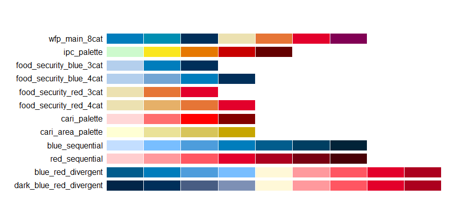

<!-- README.md is generated from README.Rmd. Please edit that file -->

# wfpthemes

## Overview

The **wfpthemes** package provides a `ggplot2` theme and a set of
colour palettes for making graphics based on WFP Data Visualization Guidelines (in progress) .
The goal of this package is to assist in the creation of charts, tables and maps
while promoting the WFP visual identity with a predefined `ggplot` theme, as well as a set of colour palettes and scales.

## Installation

This package is not on yet on CRAN and to install it, you will need the
remotes package.

``` r
install.packages("remotes")
remotes::install_github("WFP-VAM/wfpthemes")
```

## Content

A package with all necessary elements to quickly implement WFP Data Visualization Guidelines in your statistical
products and data stories:

1.  Adjusted `ggplot2` theme
2.  A series of color palettes for:
    
## Fonts

WFP uses **Open Sans** as its main font for publications and data
visualizations. Fonts often creat headaches in R so if you have problems its not your fault.

## Usage

### WFP color palette

All recommended data visualization colors are accessible as **palettes**
or **scales** (color/fill).

``` r
display_wfp_all()
```



### Example Chart

``` r
library(tidyverse)
library(wfpthemes)
library(scales)
library(labelled)

data(sampledataenglish, package = "wfpthemes")
glimpse(sampledataenglish)

#Script copied and pasted from 
#https://github.com/WFP-VAM/RAMResourcesScripts/blob/main/Indicators/Reduced-coping-strategy-index/rCSI_tidyverse.R

data <- sampledataenglish %>% mutate(rCSI = rCSILessQlty + 
                          (rCSIBorrow * 2) + 
                          rCSIMealNb + 
                          rCSIMealSize + 
                          (rCSIMealAdult * 3))

# Create table of rCSI by ADMIN1 (unweighted) ----------------------------------------------#

rcsi_admin1_table_long <- data %>% 
  mutate(ADMIN1Name_lab = to_factor(ADMIN1Name)) %>% 
  group_by(ADMIN1Name_lab) %>% 
  drop_na(rCSI) %>%   
  summarise(meanrCSI = round(mean(rCSI),1))

# Create bar graph of rCSI ----------------------------------------------------# 

rcsi_barplot <- rcsi_admin1_table_long %>% ggplot() +
  geom_col(aes(
    x = meanrCSI,
    y = reorder(ADMIN1Name_lab, meanrCSI),
  ),
  fill = wfp_pal(n = 1, "pal_blue"),
  width = 0.8
  ) +
  labs(
    tag = "Figure 7",
    title = "Reduced Coping Strategy Index (rCSI) by State | April 2023",
    subtitle = "Average rCSI  per Household by State",
    x = "rCSI",
    y = "State",
    caption = "Source: Emergency Food Security Assessment, data collected April 2023"
  ) + geom_text(aes(x = meanrCSI,
                    y = ADMIN1Name_lab, label = meanrCSI),
                hjust = -0.5,
                size = 8 / .pt
  ) +
  scale_x_continuous(
    expand = expansion(c(0, 0.1)),
    breaks = pretty_breaks(n = 7),
    labels = label_number()
  ) + theme_wfp(grid = FALSE, axis = "y", axis_title = FALSE, axis_text = "y") 

rcsi_barplot
```


## Getting help

Please report any issues or bugs on
[GitHub](https://github.com/WFP-VAM/wfpthemes/issues), try to include
a minimal reproducible example to help us understand.

## Code of Conduct

Please note that the mynewpack project is released with a [Contributor
Code of
Conduct](https://contributor-covenant.org/version/2/0/CODE_OF_CONDUCT.html).
By contributing to this project, you agree to abide by its terms.
