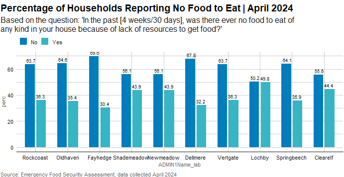
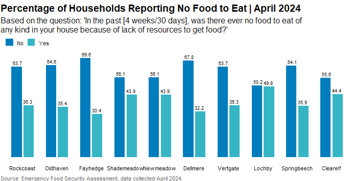

## Quick Tutorial on wfpthemes 

### using/selecting color palettes

Lets say that I wanted to create a graph of one of the Household Hunger Strategy questions.

First, make table of results (in a format easy to put in for graphing)

``` r
library(tidyverse)
library(wfpthemes)

data(sampledataenglish, package = "wfpthemes")

HHSNoFood_admin1_table_long <- sampledataenglish %>% 
  group_by(ADMIN1Name_lab = labelled::to_factor(ADMIN1Name)) %>%
  count(HHSNoFood_lab = labelled::to_factor(HHSNoFood)) %>%
  mutate(perc = 100 * n / sum(n)) %>%
  ungroup() %>% select(-n) %>% mutate_if(is.numeric, round, 1) 
  
glimpse(HHSNoFood_admin1_table_long)  
```

Second, let's take a look at available color palettes .  

``` r
display_wfp_all()
```


Since we have two response options and no need for a specific palette (like those for FCS, CARI, etc), we can use the main wfp palette - *pal_wfp_main* to create our graph.  Lets graph !

``` r
HHSNoFood_admin1_barplot <- ggplot(HHSNoFood_admin1_table_long) +geom_bar(
    aes(x = ADMIN1Name_lab, y = perc, fill = HHSNoFood_lab, group = HHSNoFood_lab), 
    stat='identity', position=position_dodge(.7),  width = 0.6,
  ) +
  geom_text(
    aes(x = ADMIN1Name_lab, y = perc, label = perc, group = HHSNoFood_lab),
    position = position_dodge(width = 0.6),
    vjust = -0.5, size = 2.5
  )+
  scale_fill_wfp_b(palette = "pal_wfp_main") +
  labs(
    title = "Percentage of Households Reporting No Food to Eat | April 2024",
    subtitle = "Based on the question: 'In the past [4 weeks/30 days], was there ever no food to eat of
any kind in your house because of lack of resources to get food?'",
    caption = "Source: Emergency Food Security Assessment, data collected April 2024"
  ) + theme_wfp()
```



``` r
plot(HHSNoFood_admin1_barplot)
```

Lastly, we applied *theme_wfp()* but it still looks ugly so let's tweak the settings in *theme_wfp()* to get rid of the unnecessary clutter. Since we already know from the title description that the y axis is a percentage and the data labels contain the values, we can remove all the y-axis labels/text/grid lines. For the x-axis, all we need is to show the  axis text (the names of the states) - the rest we can keep blank.

``` r
HHSNoFood_admin1_barplot <- HHSNoFood_admin1_barplot + theme_wfp(
    grid = FALSE,
    axis = FALSE,
    axis_title = FALSE,
    axis_text = "x")
```

``` r
plot(HHSNoFood_admin1_barplot)
```

